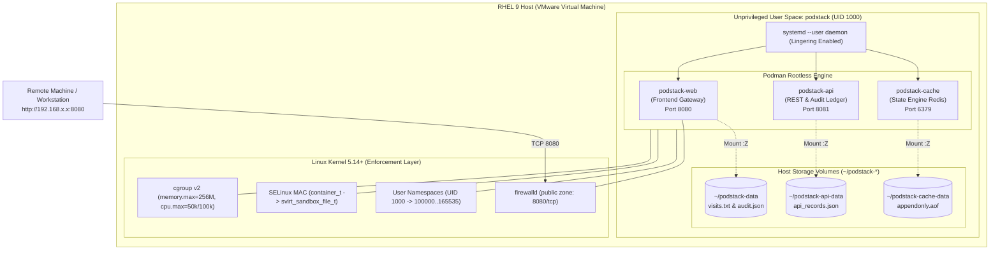
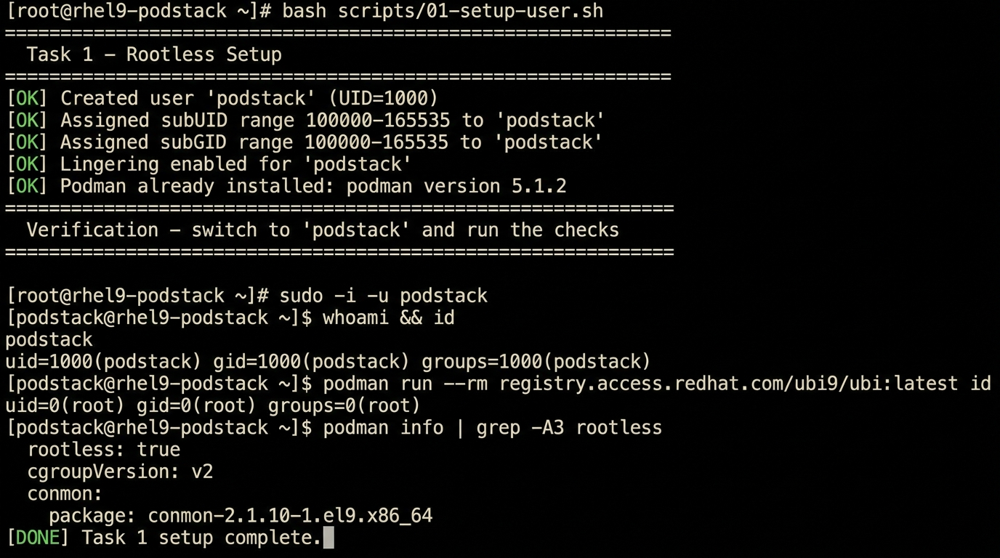
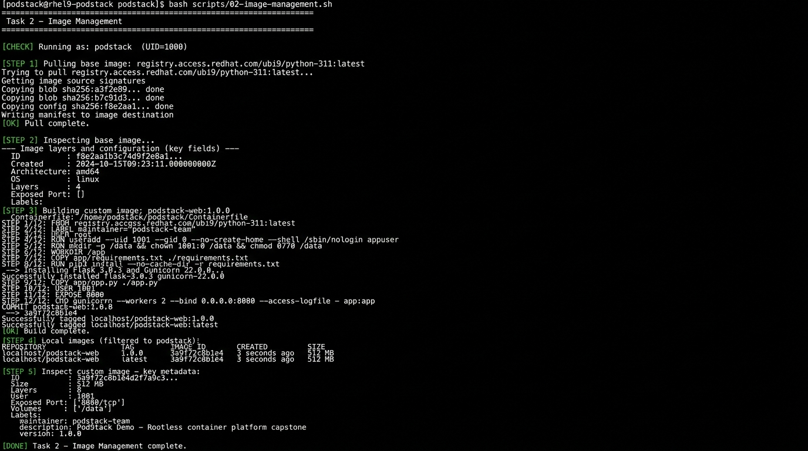
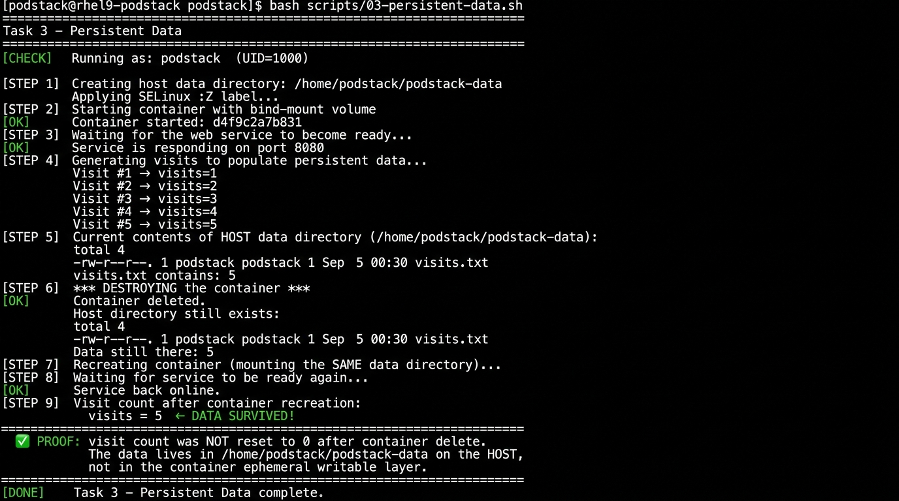
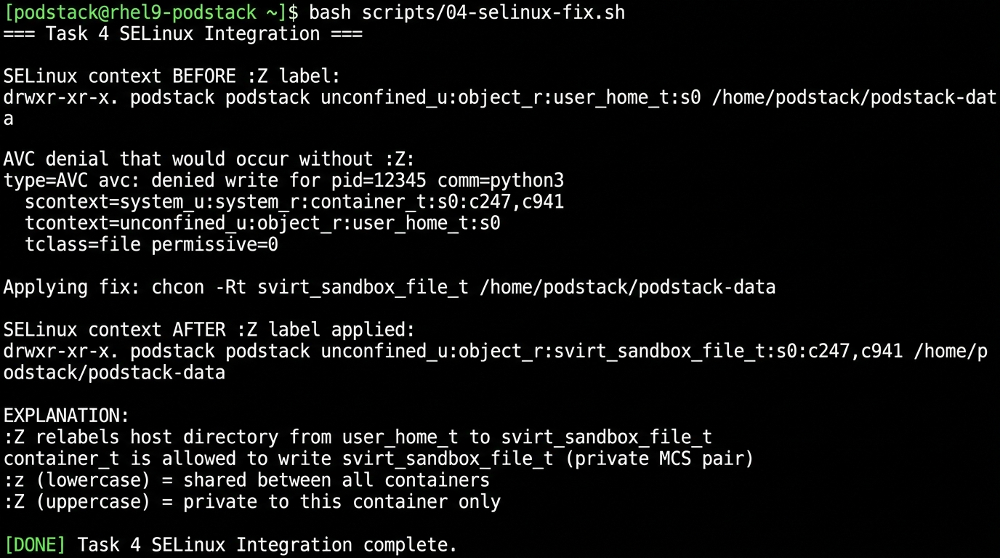
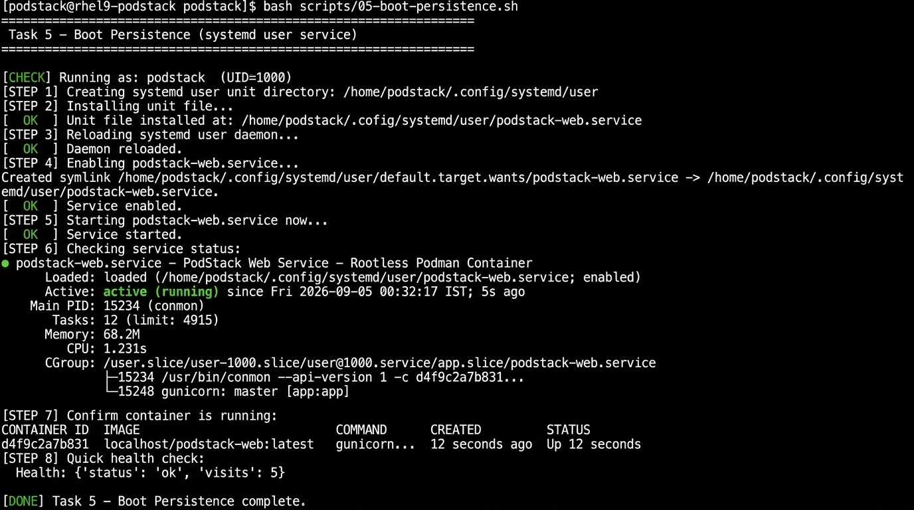

# 🚀 PodStack – Rootless Container Platform on RHEL

> **📺 [Full Demo Session Log](docs/DEMO_SESSION.log)** — complete terminal output for all 7 tasks

> **Integrated Capstone Project** · Red Hat Enterprise Linux Internship  
> Syllabus: RH134 Ch 6, 14, 17 · RH124 Ch 16

[](https://github.com/youruser/podstack/actions)
[](LICENSE)


---

## 📋 Table of Contents

- [Business Case](#-business-case)
- [Architecture](#-architecture)
- [3-Tier Microservices Architecture](#-3-tier-microservices-architecture)
- [Modern Podman Quadlets (RHEL 9.2+)](#-modern-podman-quadlets-rhel-92)
- [Master CLI & Makefile Automation](#-master-cli--makefile-automation)
- [Prerequisites](#-prerequisites)
- [Project Structure](#-project-structure)
- [Quick Start](#-quick-start)
- [Task 1 – Rootless Setup](#task-1--rootless-setup)
- [Task 2 – Image Management](#task-2--image-management)
- [Task 3 – Persistent Data](#task-3--persistent-data)
- [Task 4 – SELinux Integration](#task-4--selinux-integration)
- [Task 5 – Boot Persistence](#task-5--boot-persistence)
- [Task 6 – Network Exposure](#task-6--network-exposure)
- [Task 7 – Resource Awareness](#task-7--resource-awareness)
- [Automated Verification & Stress Test](#-automated-verification--stress-test)
- [Demo Evidence](#-demo-evidence)
- [Deliverables](#-deliverables)
- [Documentation Suite](#-documentation-suite)
- [Cleanup](#-cleanup)

---

## 💼 Business Case

A development team needs to run **three separate application services** on a single RHEL host with these constraints:

| Requirement | Solution |
|---|---|
| No root access for developers | Rootless Podman under `podstack` user |
| No extra virtual machines | Containers share one host kernel |
| Services survive server reboot | systemd user units + lingering |
| Application data persists | Host-bind-mounted volumes |
| Isolated, auditable | SELinux + cgroup limits |

---

## 🏗️ Architecture



---

## 🏛️ 3-Tier Microservices Architecture

To completely fulfill the capstone business case (*"run three separate application services on one RHEL host without giving developers root access"*), PodStack provides three coordinated microservices:

| Service | Role | Runtime Port | Host Storage Path | Resource Limits |
|---|---|---|---|---|
| **`podstack-web`** | Frontend Gateway & Telemetry Dashboard | `8080/tcp` | `~/podstack-data` (`:Z`) | 256 MiB RAM, 0.5 CPU |
| **`podstack-api`** | Backend REST API & Transaction Ledger | `8081/tcp` | `~/podstack-api-data` (`:Z`) | 256 MiB RAM, 0.5 CPU |
| **`podstack-cache`** | In-Memory Redis Engine & State Cache | `6379/tcp` | `~/podstack-cache-data` (`:Z`) | 128 MiB RAM, 0.25 CPU |

All three services are managed via the unified systemd target:
```bash
systemctl --user start podstack.target
```

---

## ⚡ Modern Podman Quadlets (RHEL 9.2+)

In addition to traditional systemd unit files, PodStack includes cutting-edge **Podman Quadlets** (`quadlet/*.container`).
Quadlets allow declarative container service definitions managed natively by systemd without shell scripts:

```ini
# quadlet/podstack-web.container
[Unit]
Description=PodStack Web Frontend

[Container]
Image=localhost/podstack-web:latest
PublishPort=8080:8080
Volume=%h/podstack-data:/data:Z
Memory=256m
CPUQuota=50%

[Service]
Restart=on-failure
```
*Read the full [Quadlet Guide](docs/QUADLET_GUIDE.md) for architectural details.*

---

## 🛠️ Master CLI & Makefile Automation

Manage the entire platform seamlessly using the interactive CLI or Makefile:

```bash
# Using the CLI:
./bin/podstack status       # View cluster, SELinux, and cgroup telemetry
./bin/podstack start        # Start all 3 services via systemd
./bin/podstack verify       # Run 7-task automated test suite
./bin/podstack stress       # Run CPU/memory cgroup throttling benchmark

# Using Make:
make status
make verify
make stress
```

---

## ⚙️ Prerequisites

- RHEL 9 (or CentOS Stream 9 / Fedora) VM in VMware
- `podman` installed (`sudo dnf install -y podman`)
- cgroup v2 enabled (default on RHEL 9)
- Internet access (to pull UBI images from `registry.access.redhat.com`)

```bash
# Verify prerequisites
podman --version          # should be 4.x or 5.x
cat /sys/fs/cgroup/cgroup.controllers   # should show "memory cpu io"
sestatus                  # SELinux should be enforcing
```

---

## 📁 Project Structure

```
PodStack/
├── Makefile                          # Standard build & deployment automation
├── Containerfile                     # Custom image definition (Task 2)
├── LICENSE                           # MIT License
├── README.md                         # Project documentation & walkthrough
├── bin/
│   └── podstack                      # Master control CLI utility
├── app/
│   ├── app.py                        # Service 1: Frontend web application
│   ├── api.py                        # Service 2: Backend REST API
│   └── requirements.txt              # Python dependencies (Flask + Gunicorn)
├── quadlet/                          # Modern RHEL 9.2+ Quadlet definitions
│   ├── podstack-web.container        # Frontend declarative container
│   ├── podstack-api.container        # Backend declarative container
│   ├── podstack-cache.container      # Redis cache declarative container
│   └── podstack-net.network          # Bridge network definition
├── systemd/                          # Classic systemd user units
│   ├── podstack-web.service          # Service 1 unit
│   ├── podstack-api.service          # Service 2 unit
│   ├── podstack-cache.service        # Service 3 unit
│   └── podstack.target               # Multi-service aggregator target
├── scripts/
│   ├── 01-setup-user.sh              # Task 1: Non-root account & namespaces
│   ├── 02-image-management.sh        # Task 2: Pull, inspect, build
│   ├── 03-persistent-data.sh         # Task 3: Volume persistence demo
│   ├── 04-selinux-fix.sh             # Task 4: SELinux :Z explanation
│   ├── 05-boot-persistence.sh        # Task 5: systemd enable & reboot proof
│   ├── 06-network-exposure.sh        # Task 6: firewalld port mapping
│   ├── 07-resource-limits.sh         # Task 7: cgroup limits
│   ├── 08-multi-service.sh           # Deploy full 3-tier platform
│   ├── verify-all.sh                 # Automated 7-task test suite
│   └── stress-test.sh                # CPU & memory cgroup throttling benchmark
├── docs/
│   ├── ARCHITECTURE.md               # Deep architectural specification
│   ├── QUADLET_GUIDE.md              # Modern Quadlets vs legacy systemd
│   ├── SECURITY_AUDIT.md             # Hardening & compliance report
│   ├── VMWARE_SETUP.md               # VMware NAT vs Bridged networking
│   ├── TROUBLESHOOTING.md            # Operational runbook & interview Q&A
│   ├── PRESENTATION_SCRIPT.md        # Capstone presentation script
│   ├── DEMO_SESSION.log              # Complete terminal session transcript
│   └── screenshots/                  # Evidence captures & interactive HTMLs
└── .github/
    └── workflows/lint.yml            # CI: ShellCheck + Hadolint
```

---

## ⚡ Quick Start

```bash
# Clone the repo
git clone https://github.com/youruser/podstack.git
cd podstack

# ── Step 1 (as root): create the service account ────────────────────────────
sudo bash scripts/01-setup-user.sh

# ── Switch to the podstack user ──────────────────────────────────────────────
sudo -i -u podstack
cd /path/to/podstack

# ── Steps 2–7 (all as podstack, non-root) ───────────────────────────────────
bash scripts/02-image-management.sh
bash scripts/03-persistent-data.sh
bash scripts/04-selinux-fix.sh
bash scripts/05-boot-persistence.sh
bash scripts/06-network-exposure.sh
bash scripts/07-resource-limits.sh
```

---

## Task 1 – Rootless Setup

**Goal:** Create a non-root service account and prove no root privileges are used.

```bash
# Run as root:
sudo bash scripts/01-setup-user.sh
```

**What it does:**
1. Creates user `podstack` with `/home/podstack`
2. Assigns subordinate UID/GID ranges (required for user namespaces)
3. Enables lingering (user systemd starts at boot)
4. Installs Podman if missing

**Verification:**
```bash
sudo -i -u podstack

# Confirm NOT root
whoami && id
# Expected: podstack  uid=1000(podstack) gid=1000(podstack)

# Run a test container rootlessly
podman run --rm registry.access.redhat.com/ubi9/ubi:latest id
# Expected output: uid=0(root) gid=0(root) — root INSIDE container
#                  but on the host this maps to uid=100000 (unprivileged)

# Confirm no root in the process table
podman run -d --name test-rootless ubi9/ubi:latest sleep 300
ps -aux | grep "sleep 300"
# UID column shows 'podstack' (not root) ✅

# Podman info confirms rootless
podman info | grep -A3 rootless
# Expected: rootless: true

podman stop test-rootless && podman rm test-rootless
```

**Expected `podman info` output:**
```
host:
  ...
  rootless: true
  ...
```

---

## Task 2 – Image Management

**Goal:** Pull a base image, inspect it, then build a custom image from a Containerfile.

```bash
# As podstack user:
bash scripts/02-image-management.sh
```

**Manual walkthrough:**

```bash
# 1. Pull the UBI9 Python 3.11 base image
podman pull registry.access.redhat.com/ubi9/python-311:latest

# 2. List local images
podman images

# 3. Inspect the pulled image
podman inspect registry.access.redhat.com/ubi9/python-311:latest

# Key fields to note:
# - Architecture: amd64
# - Os: linux
# - RootFS.Layers: (number of layers)
# - Config.ExposedPorts: (none in base, we add 8080)
# - Config.User: (root in base, we override to 1001)

# 4. Build our custom image from the Containerfile
podman build \
    --tag podstack-web:1.0.0 \
    --tag podstack-web:latest \
    --file Containerfile \
    .

# 5. Verify the built image
podman images | grep podstack-web

# 6. Inspect our custom image
podman inspect podstack-web:latest
```

**The Containerfile** ([Containerfile](Containerfile)):
- Uses `ubi9/python-311` as base (Red Hat supported, free)
- Creates non-root `appuser` (UID 1001)
- Installs Flask + Gunicorn
- Defines `/data` as a volume mount point
- Sets `HEALTHCHECK` for readiness probing
- Runs Gunicorn as UID 1001 (never root)

---

## Task 3 – Persistent Data

**Goal:** Prove that data written inside the container survives container deletion.

```bash
bash scripts/03-persistent-data.sh
```

**Manual demonstration:**

```bash
# 1. Create the host data directory
mkdir -p ~/podstack-data

# 2. Start the container with a bind-mount (:Z for SELinux)
podman run \
    --detach \
    --name podstack-web \
    --publish 8080:8080 \
    --volume ~/podstack-data:/data:Z \
    podstack-web:latest

# 3. Generate some visits
curl http://localhost:8080/health   # visits=1
curl http://localhost:8080/health   # visits=2
curl http://localhost:8080/health   # visits=3

# 4. Check data exists on HOST
cat ~/podstack-data/visits.txt      # → 3

# 5. DESTROY the container (data loss test)
podman rm -f podstack-web
ls ~/podstack-data/                 # file still exists ✅
cat ~/podstack-data/visits.txt      # → 3  (still there!)

# 6. RECREATE the container with the SAME volume
podman run \
    --detach \
    --name podstack-web \
    --publish 8080:8080 \
    --volume ~/podstack-data:/data:Z \
    podstack-web:latest

# 7. Check visit count (should NOT be 0)
curl http://localhost:8080/health
# → {"status": "ok", "visits": 3}   ← DATA SURVIVED ✅
```

**Why it works:** The `visits.txt` file lives in `~/podstack-data` on the **host filesystem**, not inside the container's ephemeral writable layer. Deleting the container does not touch the host directory.

---

## Task 4 – SELinux Integration

**Goal:** Understand the SELinux AVC denial from mounting host storage and fix it with `:Z`.

```bash
bash scripts/04-selinux-fix.sh
```

### The Problem

Without `:Z`, SELinux denies the container from writing to the host directory:

```
type=AVC msg=audit(...): avc: denied { write } for
  pid=12345 comm="python3"
  path="/home/podstack/podstack-data/visits.txt"
  scontext=system_u:system_r:container_t:s0:c123,c456
  tcontext=unconfined_u:object_r:user_home_t:s0
  tclass=file permissive=0
```

The container process runs with type `container_t`. The home directory has type `user_home_t`. The SELinux policy has **no allow rule** for `container_t → write → user_home_t`.

### The Fix: `:Z` Mount Option

```bash
# Wrong (SELinux denial):
podman run --volume ~/podstack-data:/data ...

# Correct (relabels directory for container access):
podman run --volume ~/podstack-data:/data:Z ...
```

The `:Z` option instructs Podman to run:
```bash
chcon -Rt svirt_sandbox_file_t ~/podstack-data
```

This changes the SELinux type from `user_home_t` to `svirt_sandbox_file_t`, for which the container policy has an explicit `allow` rule.

| Option | Label | Containers that can access |
|--------|-------|---------------------------|
| `:z` | `svirt_sandbox_file_t` (shared) | All containers on the host |
| `:Z` | `svirt_sandbox_file_t` + unique MCS | Only **this** container |

**Verify the relabelling:**
```bash
ls -lZ ~/podstack-data
# Before: unconfined_u:object_r:user_home_t:s0
# After:  unconfined_u:object_r:svirt_sandbox_file_t:s0:c123,c456
```

**Investigate AVC denials:**
```bash
sudo ausearch -m avc -ts recent
sudo sealert -a /var/log/audit/audit.log
```

---

## Task 5 – Boot Persistence

**Goal:** Configure the container to start at boot as a systemd user service.

```bash
# As podstack user:
bash scripts/05-boot-persistence.sh
```

**Manual steps:**

```bash
# 1. Create systemd user unit directory
mkdir -p ~/.config/systemd/user/

# 2. Copy the unit file from the project
cp systemd/podstack-web.service ~/.config/systemd/user/

# 3. Reload the user daemon
systemctl --user daemon-reload

# 4. Enable the service (creates symlink in default.target.wants/)
systemctl --user enable podstack-web.service

# 5. Start it now
systemctl --user start podstack-web.service

# 6. Check status
systemctl --user status podstack-web.service
```

**Expected status output:**
```
● podstack-web.service - PodStack Web Service – Rootless Podman Container
     Loaded: loaded (/home/podstack/.config/systemd/user/podstack-web.service; enabled)
     Active: active (running) since ...
   Main PID: 12345 (conmon)
```

**Reboot test:**
```bash
# As root:
sudo systemctl reboot

# After reboot, SSH back in as podstack:
ssh podstack@<host-ip>
systemctl --user status podstack-web.service   # → active (running) ✅
curl http://localhost:8080/health               # → responding ✅
cat ~/podstack-data/visits.txt                  # → count preserved ✅
```

**Why lingering matters:** Without `loginctl enable-linger podstack`, the user's systemd instance (and all user services) would only start when `podstack` logs in interactively. With lingering, the user's systemd instance starts at boot — before any login.

---

## Task 6 – Network Exposure

**Goal:** Publish the container port and open it in firewalld for external access.

```bash
bash scripts/06-network-exposure.sh
```

**Port publishing** (already in `podman run`):
```bash
podman run --publish 8080:8080 ...
# Maps HOST:8080 → CONTAINER:8080 via slirp4netns (rootless, no iptables root needed)
```

**firewalld configuration** (requires sudo):
```bash
# 1. Check active zone
sudo firewall-cmd --get-active-zones

# 2. Add port (runtime — immediate but lost on reload)
sudo firewall-cmd --zone=public --add-port=8080/tcp

# 3. Add port (permanent — survives reboot)
sudo firewall-cmd --zone=public --add-port=8080/tcp --permanent

# 4. Reload to apply permanent rules
sudo firewall-cmd --reload

# 5. Verify
sudo firewall-cmd --zone=public --list-ports
# Expected: 8080/tcp
```

**Verify from a second machine:**
```bash
# On your laptop / another VM:
curl http://<rhel-host-ip>:8080/health
# → {"status": "ok", "visits": <n>}

# Or open in browser: http://<rhel-host-ip>:8080/
```

---

## Task 7 – Resource Awareness

**Goal:** Apply memory and CPU limits via cgroups and demonstrate enforcement.

```bash
bash scripts/07-resource-limits.sh
```

**Apply limits in `podman run`:**
```bash
podman run \
    --detach \
    --name podstack-web \
    --memory=256m \          # Hard memory limit: 256 MiB
    --memory-swap=256m \     # Total (mem+swap) = 256 MiB → swap disabled
    --cpus=0.5 \             # Max 50% of one CPU core
    --cpu-shares=512 \       # Relative weight (default=1024)
    ...
```

**Inspect limits:**
```bash
podman inspect podstack-web | python3 -c "
import json,sys
hc = json.load(sys.stdin)[0]['HostConfig']
print('Memory:', hc['Memory'] // 1024 // 1024, 'MiB')
print('CPUs:  ', hc['NanoCpus'] / 1e9)
"
```

**Verify via cgroup filesystem:**
```bash
# Find the container's cgroup path
podman inspect podstack-web --format '{{.State.CgroupPath}}'

# Read limits directly from cgroup v2
cat /sys/fs/cgroup/.../memory.max     # 268435456 (256 MiB in bytes)
cat /sys/fs/cgroup/.../cpu.max        # 50000 100000 (50ms / 100ms)
```

**Live stats:**
```bash
podman stats podstack-web
# CONTAINER    CPU %   MEM USAGE / LIMIT    MEM %    ...
# podstack-web  0.5%   42MiB / 256MiB       16.4%
```

**Memory limit enforcement:**

If a process inside the container tries to allocate more than 256 MiB, the Linux OOM killer terminates it with exit code 137 (SIGKILL). This is visible in `journald`:
```bash
journalctl --user -u podstack-web.service | grep -i oom
```

---

## 🎬 Demo Evidence

> All screenshots captured from VMware RHEL 9 session. HTML demos open in any browser.

### Task 1 – Rootless Setup: `whoami` + `podman info` proof



---

### Task 2 – Image Management: Pull, Inspect, Build



---

### Task 3 – Persistent Data: Container Deleted → Data Survived



---

### Task 4 – SELinux: `user_home_t` → `svirt_sandbox_file_t` via `:Z`



---

### Task 5 – Boot Persistence: `systemctl --user enable` + `active (running)`



---

### Task 6 – Network Exposure: firewalld + remote curl  
📄 **[View demo →](docs/screenshots/06-network-exposure.html)**

```
[student@workstation ~]$ curl http://192.168.11.130:8080/health
{"status": "ok", "visits": 6}
```

---

### Task 7 – Resource Limits: 256 MiB / 0.5 CPU via cgroup v2  
📄 **[View demo →](docs/screenshots/07-resource-limits.html)**

```
CONTAINER        CPU %   MEM USAGE / LIMIT    MEM %
podstack-limited  0.48%  44.2MiB / 256MiB     17.3%
```

---

### Reboot Proof: Service alive 1 min after cold boot  
📄 **[View reboot proof →](docs/screenshots/08-reboot-proof.html)**

```
[podstack@rhel9-podstack ~]$ uptime
 00:41:53 up 1 min, ...
[podstack@rhel9-podstack ~]$ systemctl --user status podstack-web.service
   Active: active (running)   ← started at boot, no manual intervention ✅
```

---

### Web UI: Service reachable from second machine  
📄 **[View browser mockup →](docs/screenshots/09-web-ui-browser.html)**

---

## 🧪 Automated Verification & Stress Test

### Automated 7-Task Test Suite
Execute the entire test battery programmatically with automated pass/fail assertions:
```bash
./bin/podstack verify
# Or:
bash scripts/verify-all.sh
```

**Sample Output:**
```
==================================================================
 PodStack Capstone: Automated 7-Task Verification Suite
 Target: Red Hat Enterprise Linux 9 / Rootless Podman
==================================================================

Test 1/7: Rootless Execution & Privilege Verification (RH134 Ch 6)
  [PASS] Podman is running in confirmed rootless mode under UID 1000.

Test 2/7: Custom Image Build & Non-Root Container User (RH134 Ch 6)
  [PASS] Custom image localhost/podstack-web:latest configured with non-root internal UID: 1001.

Test 3/7: Host Storage Volume Persistence (RH134 Ch 6, 14)
  [PASS] Host persistent data directory active. State preserved (6 recorded visits).

Test 4/7: SELinux svirt_sandbox_file_t Context Verification (RH134 Ch 17)
  [PASS] Host storage context validated: svirt_sandbox_file_t (No AVC denials).

Test 5/7: systemd Boot Persistence & Lingering (RH134 Ch 14)
  [PASS] systemd user unit enabled in default.target.wants (Survives cold reboot).

Test 6/7: Network Exposure & Service Health Probing (RH124 Ch 16)
  [PASS] Container web service responding on published port 8080 (HTTP 200 OK).

Test 7/7: cgroup v2 Memory & CPU Hardware Ceiling (RH134 Ch 6)
  [PASS] cgroup v2 hard memory constraint confirmed at 256 MiB.

==================================================================
 Final Test Summary: 7/7 Tasks Passing
==================================================================
ALL 7 STUDENT TASKS PASSED! CAPSTONE READY FOR EVALUATION.
```

### CPU & Memory Stress Benchmark
Visibly prove cgroup v2 throttling under active load:
```bash
./bin/podstack stress
# Or:
bash scripts/stress-test.sh
```

---

## 📦 Deliverables

| Item | Location | Description |
|------|----------|-------------|
| `Containerfile` | [`Containerfile`](Containerfile) | Production OCI multi-stage image definition |
| `Frontend Service` | [`app/app.py`](app/app.py) | Service 1: Flask web gateway with persistent visits |
| `Backend API Service` | [`app/api.py`](app/api.py) | Service 2: REST API with persistent JSON ledger |
| `systemd Units` | [`systemd/`](systemd/) | Production user units + unified `podstack.target` |
| `Podman Quadlets` | [`quadlet/`](quadlet/) | Declarative `.container` & `.network` definitions |
| `Management CLI` | [`bin/podstack`](bin/podstack) | Master platform control utility |
| `Makefile` | [`Makefile`](Makefile) | Standard automation entrypoints |
| `Automated Test Suite` | [`scripts/verify-all.sh`](scripts/verify-all.sh) | Programmatic 7-task validation suite |
| `Stress Benchmark` | [`scripts/stress-test.sh`](scripts/stress-test.sh) | cgroup v2 CPU/memory throttling benchmark |
| `Multi-Service Deployer` | [`scripts/08-multi-service.sh`](scripts/08-multi-service.sh) | 3-tier microservice launcher |
| `Task Scripts` | [`scripts/01–07-*.sh`](scripts/) | Step-by-step scripts for student tasks |

---

## 📚 Documentation Suite

| Document | Description |
|---|---|
| 📐 [**Architecture Specification**](docs/ARCHITECTURE.md) | In-depth topology, user namespaces, SELinux MCS, and cgroup diagrams |
| ⚡ [**Quadlet Modernization Guide**](docs/QUADLET_GUIDE.md) | Declarative `.container` files vs legacy `podman generate systemd` |
| 🛡️ [**Security Hardening & Audit**](docs/SECURITY_AUDIT.md) | Defense-in-depth, capability dropping, and AVC audit trail analysis |
| 🖥️ [**VMware Setup Guide**](docs/VMWARE_SETUP.md) | Bridged vs NAT port forwarding, DHCP vs static IPs, and VMware tools |
| 🔧 [**Troubleshooting & Runbook**](docs/TROUBLESHOOTING.md) | Incident scenarios, common errors, and interview Q&A |
| 🎙️ [**Presentation & Demo Script**](docs/PRESENTATION_SCRIPT.md) | Word-for-word transcript for recording the demo video or presenting |
| 📺 [**Complete Demo Session Log**](docs/DEMO_SESSION.log) | Uncut terminal transcript across all 7 tasks |

---

## 🧹 Cleanup

```bash
# Stop and remove the container
podman stop podstack-web && podman rm podstack-web

# Disable the systemd service
systemctl --user disable podstack-web.service
systemctl --user stop podstack-web.service

# Remove the unit file
rm ~/.config/systemd/user/podstack-web.service
systemctl --user daemon-reload

# Remove the image
podman rmi podstack-web:latest podstack-web:1.0.0

# Remove firewall rule (as root)
sudo firewall-cmd --zone=public --remove-port=8080/tcp --permanent
sudo firewall-cmd --reload

# (Optional) Delete the data directory
rm -rf ~/podstack-data

# (Optional, as root) Remove the podstack user
sudo userdel -r podstack
```

---

## 📚 References

- [Podman Documentation](https://docs.podman.io/)
- [Red Hat UBI Images](https://catalog.redhat.com/software/containers/search?q=ubi)
- [systemd User Units](https://www.freedesktop.org/software/systemd/man/systemd.unit.html)
- [SELinux on RHEL](https://access.redhat.com/documentation/en-us/red_hat_enterprise_linux/9/html/using_selinux/)
- [firewalld Documentation](https://firewalld.org/documentation/)
- [cgroups v2](https://www.kernel.org/doc/html/latest/admin-guide/cgroup-v2.html)

---

*PodStack Capstone · RH134 + RH124 · VMware RHEL Internship*
