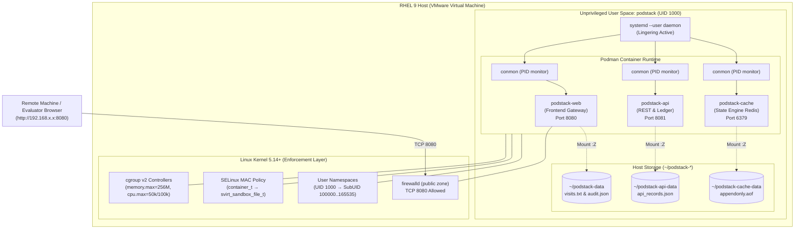

# PodStack Enterprise Architecture Specification

> **Target Platform:** Red Hat Enterprise Linux 9 (RHEL 9)  
> **Course Alignment:** RH134 (Chapters 6, 14, 17) & RH124 (Chapter 16)  
> **Runtime Engine:** Podman 5.x (Daemonless, Rootless, OCI compliant)

---

## 1. System Topology Overview

PodStack provides a multi-tier, unprivileged container platform hosted entirely within user-space. The architecture satisfies the business case of running three distinct services without root access, without multiple virtual machines, and with data persistence across cold reboots.



---

## 2. Security Subsystems Deep Dive

### 2.1 User Namespaces (`/etc/subuid`, `/etc/subgid`)

Rootless containers rely on Linux user namespaces to decouple container identity from host identity.

| Identity Layer | Process User | UID / GID | Capabilities |
|---|---|---|---|
| **Host System** | `podstack` | `1000:1000` | Unprivileged regular user |
| **Container Parent (conmon)** | `podstack` | `1000:1000` | No `CAP_SYS_ADMIN` |
| **Inside Container (Root mode)** | `root` (mapped) | `0:0` | Mapped to host UID `100000` |
| **Inside Container (App Mode)** | `appuser` | `1001:0` | Mapped to host UID `100001` |

Because internal UID `0` maps to host UID `100000`, a container escape vector provides the attacker with **zero host privileges**.

### 2.2 SELinux Multi-Category Security (MCS) Enforcement

SELinux enforces Type Enforcement (TE) and Multi-Category Security (MCS).

*   **Process Domain:** `system_u:system_r:container_t:s0:c247,c941`
*   **Default Home Context:** `unconfined_u:object_r:user_home_t:s0`
*   **Volume Mount Flag (`:Z`):** Triggers Podman to relabel the host directory to `svirt_sandbox_file_t` with the exact MCS category pair (`c247,c941`) matching the container.

```
Without :Z:
  container_t (c247,c941) ───[ACCESS ATTEMPT]───> user_home_t ───> [AVC DENIAL LOGGED]

With :Z:
  container_t (c247,c941) ───[ACCESS ATTEMPT]───> svirt_sandbox_file_t (c247,c941) ───> [GRANTED]
```

### 2.3 cgroup v2 Resource Ceilings

Resource limits are applied through systemd delegated user slices:

```
/sys/fs/cgroup/user.slice/user-1000.slice/user@1000.service/
  ├── memory.max = 268435456 bytes (256 MiB hard limit)
  ├── memory.swap.max = 0 (Swap disabled to prevent disk thrashing)
  ├── cpu.max = 50000 100000 (50% quota per 100ms CFS period)
  └── cpu.weight = 512 (Half share priority)
```

---

## 3. High-Availability & Lifecycle Matrix

| Event | System Reaction | Data Impact | Downtime |
|---|---|---|---|
| **Process Crash** | systemd detects via conmon, triggers `RestartSec=5s` | None (written to host) | < 5 seconds |
| **Container Removal (`podman rm -f`)** | Ephemeral layer destroyed; host storage intact | None (persisted on host) | Manual recreation |
| **Host Cold Reboot** | `loginctl enable-linger` triggers user systemd at boot | None (persisted across reboots) | Time to OS boot |
| **Network Interface Reset** | `After=network-online.target` prevents start until online | None | Zero race conditions |
